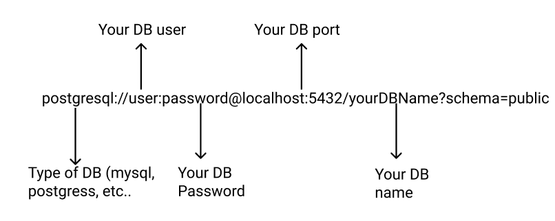

<h1 align="center">
  Welcome to IClinic 👋
</h1>


## 💻 Project
📖 Create a project to create, update, list and delete laboratory and exams

## 🔨 Features

- [X] Create laboratory 
- [X] Delete laboratory 
- [X] List laboratory 
- [X] List laboratory by exam name
- [X] update laboratory

- [X] Create exam 
- [X] Delete exam 
- [X] List exams
- [X] Update exam by exam name


## ✨ Technologies

- [X] Express
- [X] Typescript
- [X] Prisma
- [X] Swagger

## Getting Started

* First, you have to install the packages

```bash
npm install
# or
yarn
```
* Create a new DB


* After alter you .env

<p align="center">

 
</p>

Run the command to create tables:

```bash
npx prisma db push
```
  

Run the development server:

```bash
npm run dev
# or
yarn dev
```

Open [http://localhost:3333/api-docs](http://localhost:3333/api-docs) with your browser to see the result.
